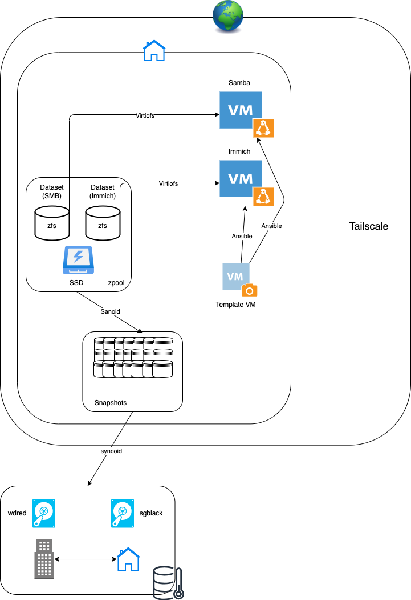

# Ansible playbooks for homelab.

WORK IN PROGRESS 🔨🧱🏗️



## VMs

| Server       | IP          | User       | Services/ports.              | os  |
|--------------|-------------|------------|------------------------------|-----------|
| Services     | 10.0.0.44   | haaksk     | samba, immich,2283           | Alma 9.5  |
| Proxmox      | 10.0.0.41   | root       | Hypervisor:8006.             | Debian    |
| Workmachine2 | 10.0.0.21   | haaksk     |                              |Fedora 42  |

## Setup

Install ansible with extensions on machine you run ansible on.
```sh
brew install ansible ansible-lint

ansible-galaxy collection install ansible.posix --force
ansible-galaxy collection install community.general --force
ansible-galaxy collection install community.docker --force
```

Playbooks require passwordless ssh to server. I configure this automatically in the template I clone.

```sh
uv venv
uv pip install -r requirements.txt
pre-commit install
```

Before commit run

```sh
pre-commit run --all-files
```

Add a file `.vault_pass` with vault password

# Proxmox

## First setup

- Change repos to non-subscription
- Upgrade and update
- Create vm template, see below
- Create zfs datasets, see below
- Something with snippets?
- Install `vim` and `wget`

## IGPU passthrough
Create a resource mapping in datacenter for the igpu. Add as pcie to vm. make sure immou, vt-d etc are enabled in bios on host. 

## ZFS

- Create a zfs pool `storage`
  ```sh
  zpool create storage /dev/sdX
  ```
- Create a dataset `immich` and `smb`
    ```sh
    zfs create storage/immich
    zfs create storage/smb
    ```
In Datacenter - Directory Mapping create mapping/tag for both datasets


#### Immich restore

script for Immich restore
```sh
cd /home/haaksk/immich-app
docker compose down -v
docker compose pull
docker compose create
docker start immich_postgres
sleep 10
sudo gunzip --stdout "$(sudo ls /mnt/storage/immich/library/backups/immich-db-backup-*.sql.gz | sort -V | tail -n 1)" | sed "s/SELECT pg_catalog.set_config('search_path', '', false);/SELECT pg_catalog.set_config('search_path', 'public, pg_catalog', true);/g" | docker exec -i immich_postgres psql --dbname=postgres --username=postgres
docker compose up -d
```

# Backups external harddrives

create encrypted pools like this for ssds
```sh
zpool create \
    -o ashift=12 \
    -o autotrim=on \
    -O encryption=on \
    -O keylocation=file:///root/key.key \
    -O keylocation=prompt \
    -O compression=lz4 \
    -O acltype=posixacl \
    -O xattr=sa \
    -O dnodesize=auto \
    -O normalization=formD \
    -O relatime=on \
    -O mountpoint=/MOUNTPOINT \
    NAMEOFPOOL /path/to/disc
```

for spinning discs
```sh
zpool create \
-o ashift=12 \
-O encryption=on \
-O keyformat=raw \
-O keylocation=file:///root/key.key \
-O compression=lz4 \
-O acltype=posixacl \
-O xattr=sa \
-O dnodesize=auto \
-O normalization=formD \
-O relatime=on \
-O mountpoint=/MOUNTPOUNT \
NAMEOFPOOL /path/to/disc
```

mount external zpool
```sh
zpool import wdred
zfs load-key -r wdred
```

unmount
```sh
zfs unmount -a wdred
zpool export wdred
```

## Restore

List most recent snapshot
```sh
zfs list -t snapshot -o name,creation -s creation | tail -n 2
```

## sanoid

[Managed by `servers/proxmox-41/sanoid-setup.yml`](servers/proxmox-41/sanoid-setup.yml)

# Remote desktop
- install xrdp
- force layout *414 in xrdp.ini

```sh
sudo dnf install xrdp -y
sudo systemctl enable xrdp
sudo systemctl start xrdp
sudo firewall-cmd --permanent --add-port=3389/tcp
sudo firewall-cmd --reload
sudo chcon --type=bin_t /usr/sbin/xrdp
sudo chcon --type=bin_t /usr/sbin/xrdp-sesman
```

debian:

```sh
sudo apt install ufw openssh-server
sudo systemctl ufw enable --now
sudo ufw allow ssh
```

```sh
sudo apt update
sudo apt install xrdp -y
sudo systemctl enable xrdp
sudo systemctl start xrdp
sudo ufw allow 3389/tcp
```

### digikam remote database

```sh
sudo dnf install mariadb-server -y
sudo systemctl start mariadb
sudo systemctl enable mariadb
sudo mysql_secure_installation
sudo mysql -u root -p
``` 

```sql
CREATE DATABASE digikam CHARACTER SET utf8mb4 COLLATE utf8mb4_unicode_ci;
CREATE DATABASE digikam_thumbs CHARACTER SET utf8mb4 COLLATE utf8mb4_unicode_ci;
-- You might also want databases for similarity and face recognition later
CREATE DATABASE digikam_similarity CHARACTER SET utf8mb4 COLLATE utf8mb4_unicode_ci;
CREATE DATABASE digikam_faces CHARACTER SET utf8mb4 COLLATE utf8mb4_unicode_ci;
``` 

```sql
CREATE USER 'haaksk'@'10.0.0.%' IDENTIFIED BY 'PASSORDHER';
GRANT ALL PRIVILEGES ON digikam.* TO 'haaksk'@'10.0.0.%';
GRANT ALL PRIVILEGES ON digikam_thumbs.* TO 'haaksk'@'10.0.0.%';
GRANT ALL PRIVILEGES ON digikam_similarity.* TO 'haaksk'@'10.0.0.%';
GRANT ALL PRIVILEGES ON digikam_faces.* TO 'haaksk'@'10.0.0.%';
FLUSH PRIVILEGES;
``` 

edit `/etc/my.cnf.d/mariadb-server.cnf` and set `bind-address = 10.0.0.44`

```sh
sudo systemctl restart mariadb
sudo firewall-cmd --zone=public --add-service=mysql --permanent
sudo firewall-cmd --reload
``` 

Turn off harddrive
```sh
hdparm -y /dev/sda
```

```sh
rsync -aAXHv --info=progress2 /Volumes/WD4TBHS/Lightroom/ root@10.0.0.41:/storage/smb/Pictures
```

fix permissions
```sh
find /storage/smb/Pictures/ -type f -exec chmod 0664 {} \;
find /storage/smb/Pictures/ -type d -exec chmod 755 {} \;
chown -R immich_docker_usr:immich_docker_grp /storage/smb/Pictures/
```


```sh

DROP DATABASE IF EXISTS digikam;
DROP DATABASE IF EXISTS digikam_thumbs;
DROP DATABASE IF EXISTS digikam_similarity;
DROP DATABASE IF EXISTS digikam_faces;

-- Recreate databases
CREATE DATABASE digikam CHARACTER SET utf8mb4 COLLATE utf8mb4_unicode_ci;
CREATE DATABASE digikam_thumbs CHARACTER SET utf8mb4 COLLATE utf8mb4_unicode_ci;
CREATE DATABASE digikam_similarity CHARACTER SET utf8mb4 COLLATE utf8mb4_unicode_ci;
CREATE DATABASE digikam_faces CHARACTER SET utf8mb4 COLLATE utf8mb4_unicode_ci;


DROP USER IF EXISTS 'haaksk'@'10.0.0.%';
CREATE USER 'haaksk'@'10.0.0.%' IDENTIFIED BY 'PASSORD';

-- Grant all privileges on the new databases
GRANT ALL PRIVILEGES ON digikam.* TO 'haaksk'@'10.0.0.%';
GRANT ALL PRIVILEGES ON digikam_thumbs.* TO 'haaksk'@'10.0.0.%';
GRANT ALL PRIVILEGES ON digikam_similarity.* TO 'haaksk'@'10.0.0.%';
GRANT ALL PRIVILEGES ON digikam_faces.* TO 'haaksk'@'10.0.0.%';

-- Apply the privilege changes
FLUSH PRIVILEGES;

-- Exit the MariaDB prompt
EXIT;
```


## Pictures stuff

rename existing pictures:
```sh
exiftool -r -d '%Y-%m-%d_%H-%M-%S' '-filename<${FileModifyDate}_${FileName}' '-filename<${CreateDate}_${FileName}' '-filename<${DateTimeOriginal}_${FileName}'  TARGET_DIR
```
