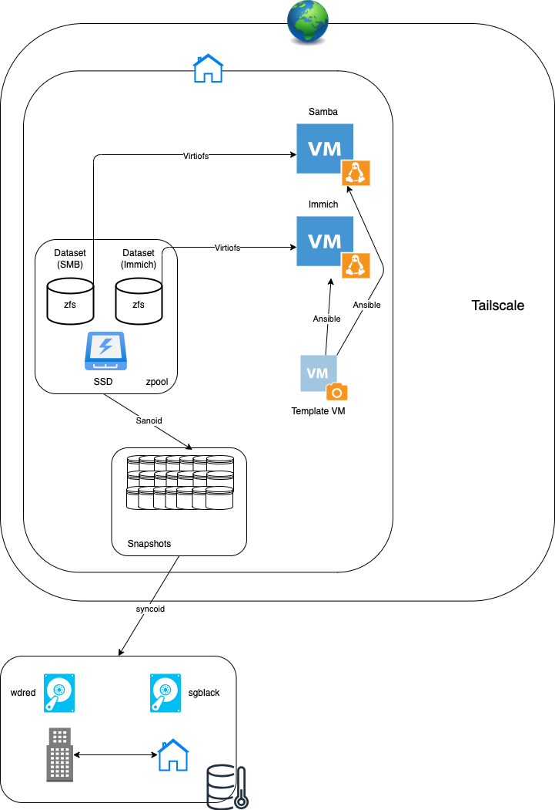

# Ansible playbooks for homelab. 

WORK IN PROGRESS 🔨🧱🏗️



## Setup

Install ansible with extensions. 
```sh
brew install ansible ansible-lint

ansible-galaxy collection install ansible.posix --force
ansible-galaxy collection install community.general --force
ansible-galaxy collection install community.docker --force
```

Playbooks require passwordless ssh to server. I configure this automatically in the template I clone.

```sh
uv venv
uv pip install -r requirements.txt
pre-commit install
```

Before commit run

```sh
pre-commit run --all-files
```

Add a file `.vault_pass` with vault password

# Proxmox

## First setup

- Change repos to non-subscription
- Upgrade and update
- Create vm template, see below
- Create zfs datasets, see below
- Something with snippets?
- Install `vim` and `wget`

## ZFS

- Create a zfs pool `storage`
  ```sh
  zpool create storage /dev/sdX
  ```
- Create a dataset `immich` and `smb`
    ```sh
    zfs create storage/immich
    zfs create storage/smb
    ```
In Datacenter - Directory Mapping create mapping/tag for both datasets


## VM template

- On proxmox host, download alma cloud image into `/var/lib/vz/template/qcow`

```sh
cd /var/lib/vz/template/qcow
# wget ....
qm create 9000 --name alma-cloud-template --memory 4096 --net0 virtio,bridge=vmbr0
qm importdisk 9000 AlmaLinux-9-GenericCloud-9.5-20241120.x86_64.qcow2 local-lvm
qm set 9000 --scsihw virtio-scsi-pci --scsi0 local-lvm:vm-9000-disk-0
qm set 9000 --ide2 local-lvm:cloudinit
qm set 9000 --boot c --bootdisk scsi0
qm set 9000 --serial0 socket --vga serial0
```
Edit 9000:
- Options:
    - Start on boot
- Hardware
    - Memory: Remove ballooning
    - Processors: more cpu and socket, enable Numa, cpu type: Host
    - Hard Disk: enable ssd emulation
- Cloud-init:
    - set username and password
    - paste in id_rsa.pub
    - ip config -> static
    - dns host is `telenor.net`
    - dns-server is `148.122.164.253`

## Cloning - Setting up servers/vms

Make sure dns host is `telenor.net` and dns-server is `148.122.164.253`. Otherwise it might inherit tailscale settings from proxmox.

### Fileserver
- `Hardware` add virtiofs with tag and enable xattr for samba share.
- Set ip to 10.0.0.44/24 with gateway 10.0.0.138

Setup with
```sh
ansible-playbook -i servers/inventory.yml -K --ask-vault-pass servers/fileserver-44/main.yml 
```

### Immich server
- `Hardware` Add virtiofs for immich dataset.
- Set ip to 10.0.0.42/24 with gateway 10.0.0.138

Setup with 
```sh
ansible-playbook -i servers/inventory.yml -K servers/immich-42/main.yml 
```

This does not install or restore Immich, just sets up server.

#### Immich restore
gunzip command for database restore:
```sh
cd /home/haaksk/immich-app
docker compose down -v
docker compose pull 
docker compose create 
docker start immich_postgres
sleep 10 
sudo gunzip --stdout "$(sudo ls /mnt/storage/immich/library/backups/immich-db-backup-*.sql.gz | sort -V | tail -n 1)" | sed "s/SELECT pg_catalog.set_config('search_path', '', false);/SELECT pg_catalog.set_config('search_path', 'public, pg_catalog', true);/g" | docker exec -i immich_postgres psql --dbname=postgres --username=postgres
docker compose up -d 
```


# Backups external harddrives

create encrypted pools like this for ssds
```sh
zpool create \
    -o ashift=12 \
    -o autotrim=on \
    -O encryption=on \
    -O keyformat=passphrase \
    -O keylocation=prompt \
    -O compression=lz4 \
    -O acltype=posixacl \
    -O xattr=sa \
    -O dnodesize=auto \
    -O normalization=formD \
    -O relatime=on \
    -O mountpoint=/wdred \
    wdred /dev/sda1
```

mount external zpool
```sh
zpool import wdred
zfs load-key -r wdred
```

unmount
```sh
zfs unmount -a wdred
zpool export wdred
```

## Restore

List most recent snapshot
```sh
zfs list -t snapshot -o name,creation -s creation | tail -n 2
zfs send wedred/backups/LATEST_IMMICH_SNAPSHOT | zfs receive storage/immich
```

## sanoid

[Managed by `servers/proxmox-41/sanoid-setup.yml`](servers/proxmox-41/sanoid-setup.yml)

