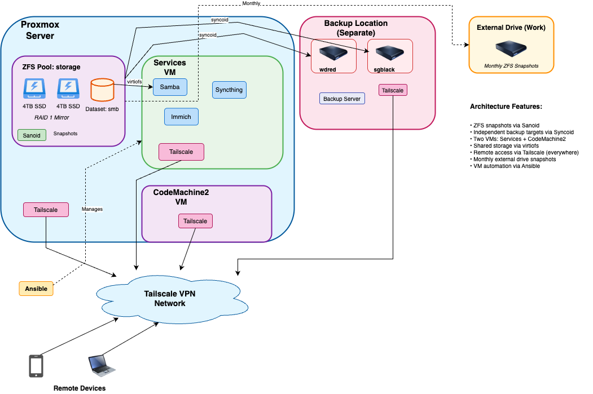

# My Homelab: GitOps & Resilient Self-Hosting

## Tech Stack

                 

---

This infrastructure is built on Proxmox, ZFS, and a **GitOps/Infrastructure as Code (IaC)** model, engineered to achieve the **3-2-1 backup rule** with dedicated redundancy.

### Automation & Maintenance

My homelab uses a strict GitOps principle where a single GitHub repository is the source of truth. All VMs are build from Alma Linux.

- **"Nuke and Pave" Pipeline:** A **`github-runner` VM** executes the CI/CD pipeline. To prevent drift, major updates involve destroying the old instance and reprovisioning a new one from the Golden Image.
- **Weekly Maintenance:** Ansible configures local **cron jobs** on VMs to handle OS updates, service restarts, and updates for Pi-hole and Docker Compose apps.
- **Alerting:** Scripts log activity and provide instant feedback (success/failure) to my phone via **Pushover**.
- **Observability:** **Loki** centralizes log aggregation from all VMs (via **Promtail**), while **Grafana** provides visualization and monitoring dashboards for the entire infrastructure.

### Core Infrastructure & Security

- **Primary Host:** Focused on storage performance, running a ZFS **RAID 1 Mirror** (2x 4TB SSDs). Services use raw ZFS performance by mounting datasets via **virtiofs**.
- **Secondary Host:** A physical host ensuring high availability, running failover instances of the **Tailscale Subnet-Router** and **Pi-hole**.
- **Security:** All VMs have firewalls enabled and run **SELinux in enforcing mode**. Host access is restricted to **SSH Keys**.

### Network & Services

**Tailscale** provides a secure mesh backbone with HTTPS access via **Tailscale Serve** proxying through the subnet-router for mobile clients. Primary and secondary Pi-hole VMs provide content filtering and DNS resolution for the entire network via the gateway.

- **Key VMs:** **`github-runner`** (CI/CD), **`samba`** (File server/backup ingestion), **`immich`** (Photos/Video), **`loki`** (Log aggregation), **`grafana`** (Monitoring/Visualization), and **`services`** (Docker host for Jellyfin, Syncthing, CouchDB, Nebula).
- **CouchDB** on services VM provides self-hosted Obsidian LiveSync for notes synchronization across iPhone, Android, Windows, and Linux devices with HTTPS access via Tailscale.

### Data Protection (3-2-1 Strategy)

1.  **Local:** **Sanoid** automates the creation and pruning of local ZFS snapshots.
2.  **Offsite:** An Ubuntu Server with a ZFS pool (2x 4TB HDDs) is **housed offsite**. **Syncoid** manages the scheduled replication over VPN.
3.  **Offline:** A 4TB external drive provides the air-gapped component. It is manually synced and stored offline to protect against ransomware.

